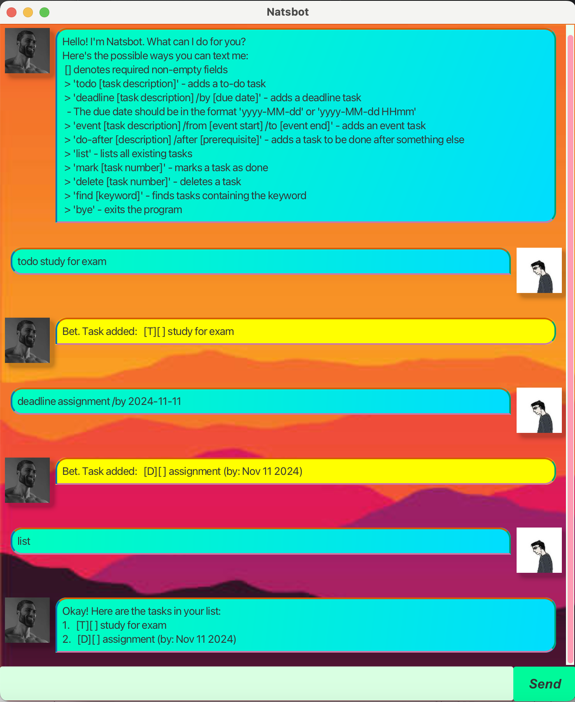

# Natsbot User Guide



Natsbot is an all-in-one chatbot and task manager that:
* helps you keep track of your various tasks and deadlines
* runs on the command line interface (CLI) 
* is optimized for use via a keyboard

## Adding deadlines

Add a new task with a deadline to your list.

Example: `deadline return book /by 2024-10-19`

```
Bet. Task added:  [D][] return book (by: Oct 19 2024)
```

Example: `deadline complete assignment /by 2024-10-19 1300`

```
Bet. Task added:  [D][] complete assignment (by: Oct 19 2024 13:00)
```

## Marking tasks as done

Mark a task as complete with an 'X'.

Example: 

`todo essay` 
```
Bet. Task added:  [T][] essay
```
`done 1`
```
Cool! I've marked the following as done:
  [T][X] essay
```

## Viewing task list

View the full list of tasks you currently have.

Example:

`event party /from 9pm /to /1am`
```
Bet. Task added:  [E][] party (from: 9pm to: 1am)
```
`do-after sleep /after partying`
```
Bet. Task added:  [A][] sleep (after: partying)
```
`list`
```
Okay! Here are the tasks in your list:
1. [E][] party (from: 9pm to: 1am)
2. [A][] sleep (after: partying)
```

## Finding tasks

Find a specific task by keyword.

Example:

`todo essay on football club`
```
Bet. Task added:  [T][] essay on football club
```
`find football`
```
Okay! Here are the matching tasks in your list:
1. [T][] essay on football club
```

Thank you for using Natsbot!

Feel free to email me at [nathanlooenping@gmail.com](mailto:nathanlooenping@gmail.com) if you have any queries or suggestions.
